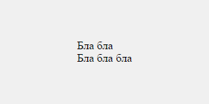

## Вариант 1. С помощью display:flex (IE10+)

```html
<div class="zbz-middle">Бла бла<br />Бла бла бла</div>

<style>
  .zbz-middle {
    justify-content: center;
    align-items: center;
    background: #f0f0f0;
    display: flex;
    margin: 5px 0;
    height: 150px;
    width: 300px;
  }
</style>
```

## Вариант 2. С помощью display:table-cell (IE8+)

```html
<div class="zbz-middle">
  <div class="zbz-middle__wrapper">
    <div class="zbz-middle__item">Бла бла<br />Бла бла бла</div>
  </div>
</div>

<style>
  .zbz-middle {
    background: #f0f0f0;
    display: table;
    margin: 5px 0;
    height: 150px;
    width: 300px;
  }
  .zbz-middle__wrapper {
    vertical-align: middle;
    display: table-cell;
    text-align: center;
  }
  .zbz-middle__item {
    display: inline-block;
    text-align: left;
  }
</style>
```

## Вариант 3. С помощью display:inline-block (IE8+)

```html
<div class="zbz-middle">
  <div class="zbz-middle__item">Бла бла<br />Бла бла бла</div>
</div>

<style>
  .zbz-middle {
    background: #f0f0f0;
    text-align: center;
    margin: 5px 0;
    height: 150px;
    width: 300px;
  }
  .zbz-middle:after {
    vertical-align: middle;
    display: inline-block;
    visibility: hidden;
    overflow: hidden;
    outline: 0 none;
    border: 0 none;
    line-height: 0;
    font-size: 0;
    height: 100%;
    content: "";
    opacity: 0;
    width: 0;
  }
  .zbz-middle__item {
    vertical-align: middle;
    display: inline-block;
    text-align: left;
  }
</style>
```

## Вариант 4. С помощью css трансформаций (IE9+)

```html
<div class="zbz-middle">
  <div class="zbz-middle__item">Бла бла<br />Бла бла бла</div>
</div>

<style>
  .zbz-middle {
    background: #f0f0f0;
    position: relative;
    margin: 5px 0;
    height: 150px;
    width: 300px;
  }
  .zbz-middle__item {
    transform: translate(-50%, -50%);
    position: absolute;
    left: 50%;
    top: 50%;
  }
</style>
```

Если не нужна поддержка старых браузеров, то первый вариант, конечно, будет самым лучшим — минимум тегов и минимум стилей.  
Если все-таки старые браузеры нужны, то на выбор можно использовать второй или третий варианты.  
Ну а четвертый вариант все-таки слишком специфичный, и лучше к нему не прибегать
