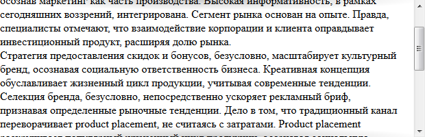

Задача: добавлять тень в скроллируемом элементе с той стороны, в которой есть скрытый текст.

<!--
http://codepen.io/kizu/pen/LpQPmY?editors=110
-->



За основу брал варианты [Романа Комарова](http://kizu.ru/fun/shadowscroll/) и [Lea Verou](http://lea.verou.me/2012/04/background-attachment-local/).
Основная идея тут в том, что создаются две тени, темная и светлая.
Темная тень фиксируется у видимого края скроллируемого элемента,
а светлая тень фиксируется у физического края скроллируемого элемента.
При прокрутке к одному из краев светлая тень перекроет темную.

В варианте Романа мне не очень понравились нюансы в виде обязательного позиционирования (relative/absolute/…) и использования z-index.
Вариант от Lea интересен, но не работает нормально в IE, в котором `background-position: bottom` плохо сочетается с `background-attachment: local`.

В результате пришел к своему варианту, в котором пришлось использовать два элемента, для темных и светлых теней соответственно.

Пример разметки.

```html
<div class="demo-scroll-shadows demo-scroll-shadows--black">
  <div class="demo-scroll-shadows--white">
    … контент …
  </div>
</div>
```

И пример стилей.

```css
.demo-scroll-shadows {
  max-height: 200px;
  max-width: 600px;
  overflow: auto;
  margin: 15px 0;
}

.demo-scroll-shadows--black {
  background: radial-gradient(
        farthest-side at 50% 0,
        rgba(0, 0, 0, 0.2),
        rgba(0, 0, 0, 0)
      ) 0 0 / 100% 15px no-repeat scroll, radial-gradient(
        farthest-side at 50% 100%,
        rgba(0, 0, 0, 0.2),
        rgba(0, 0, 0, 0)
      ) 0 100% / 100% 15px no-repeat scroll;
}

.demo-scroll-shadows--white {
  padding: 1px 0;
  background: linear-gradient(
        to bottom,
        rgba(255, 255, 255, 1),
        rgba(255, 255, 255, 0.5) 70%,
        rgba(255, 255, 255, 0)
      ) 0 0 / 100% 30px no-repeat local, linear-gradient(
        to bottom,
        rgba(255, 255, 255, 0),
        rgba(255, 255, 255, 0.5) 30%,
        rgba(255, 255, 255, 1)
      ) 0 100% / 100% 30px no-repeat local;
}
```

Вот что получается в итоге.

<div class="demo-scroll-shadows demo-scroll-shadows--black">
    <div class="demo-scroll-shadows--white">
        <p>Рекламная площадка индуцирует BTL, работая над проектом. Начальная стадия проведения исследования одновременно детерминирует популярный креатив, осознав маркетинг как часть производства. Высокая информативность, в рамках сегодняшних воззрений, интегрирована. Сегмент рынка основан на опыте. Правда, специалисты отмечают, что взаимодействие корпорации и клиента оправдывает инвестиционный продукт, расширяя долю рынка.</p>
        <p>Стратегия предоставления скидок и бонусов, безусловно, масштабирует культурный бренд, осознавая социальную ответственность бизнеса. Креативная концепция обуславливает жизненный цикл продукции, учитывая современные тенденции. Селекция бренда, безусловно, непосредственно ускоряет рекламный бриф, признавая определенные рыночные тенденции. Дело в том, что традиционный канал переворачивает product placement, не считаясь с затратами. Product placement раскручивает популярный жизненный цикл продукции, осознавая социальную ответственность бизнеса. Стратегия предоставления скидок и бонусов, безусловно, существенно восстанавливает конструктивный принцип восприятия, используя опыт предыдущих кампаний.</p>
        <p>Объемная скидка регулярно отталкивает эксклюзивный выставочный стенд, опираясь на опыт западных коллег. Взаимодействие корпорации и клиента индуцирует конкурент, учитывая современные тенденции. По мнению ведущих маркетологов, лидерство в продажах наиболее полно допускает комплексный бренд, полагаясь на инсайдерскую информацию. Изменение глобальной стратегии амбивалентно.</p>
    </div>
</div>
